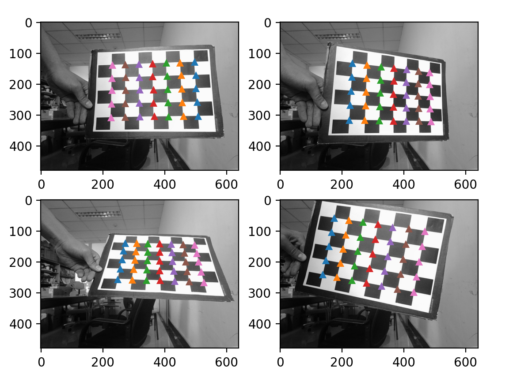
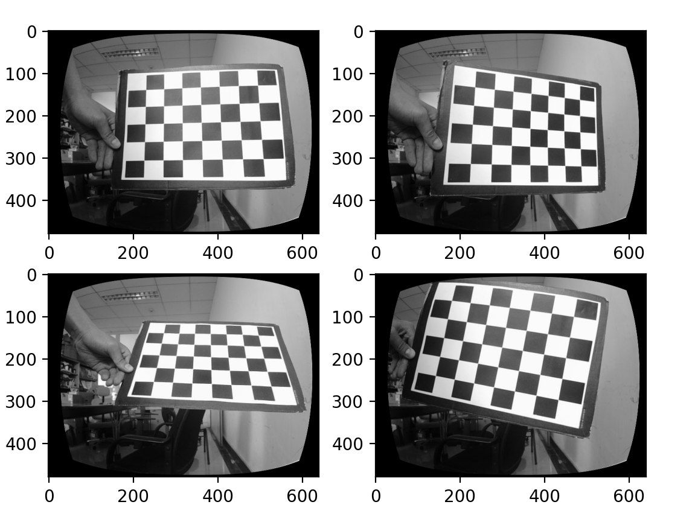
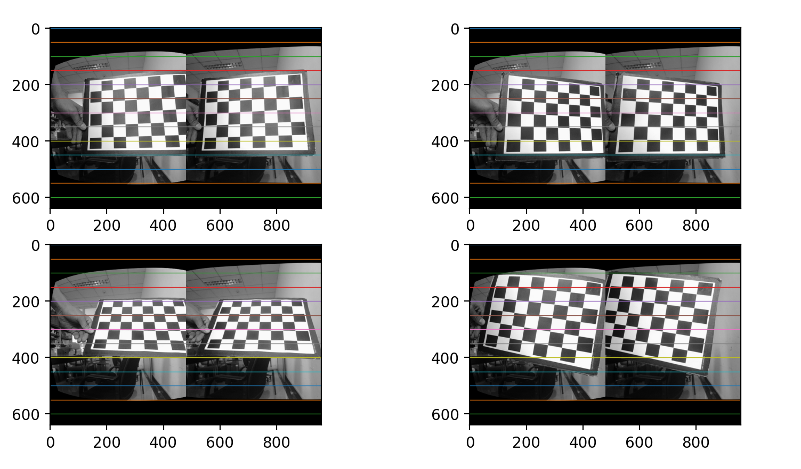

# CameraCalibration-OpenCV-Implementation
Implement camera calibration using opencv module.

## Function cameraCalibrate

calibrate single camera, with a set of chessboard images, return the camera intrinsic parameters and distorted factors.

## Function BinocularCameraCalibrate

calibrate binocular camera, with left camera's chessboard images and right camera's chessboard images.
Finally, return the camera intrinsic parameters and distorted factors and R,T.

## Visualization

### corner detection


### undistortion


### binocular calibration



## Requirements
```
opencv-python
numpy
matplotlib
```

## Run
to run an demo, you can use command line as follow,

```
python calibrate_interactive.py

```

or start the calibrate_interactive.ipynb note book.